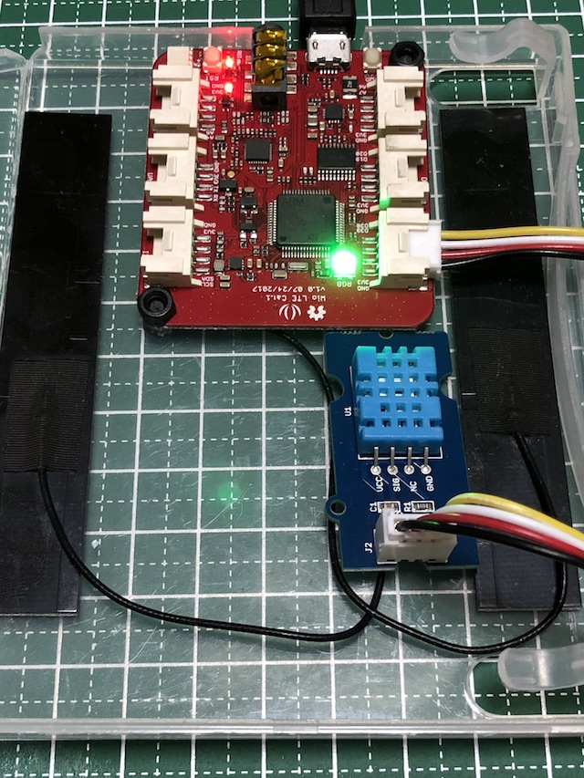
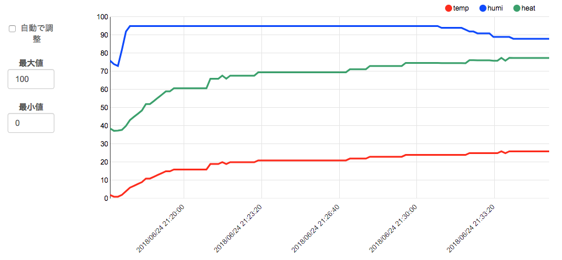
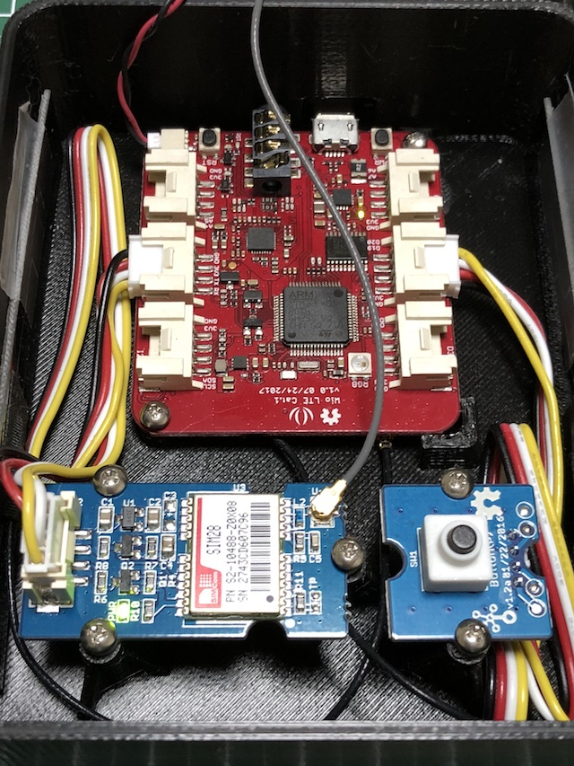

# SORACOM Conference "Discovery" 2018
## 今すぐ始めよう SORACOM ”自習”コーナー Wio LTE ハンズオン

## 目的
LTEモジュールが搭載された[Wio LTEデバイス](https://soracom.jp/products/wio_lte/)、様々なGroveセンサー、SORACOM SIMカードを使い、簡単なIoTシステムを体感いただきます。

## 本日の前提
こちらのハンズオンでは、既に PC、SORACOM アカウントとそれに紐づくSIMカードに加え、Wio LTEデバイスを利用するために必要な環境のセットアップを用意しています。
また、本ハンズオンはご自身でテキストに沿って進めていただく形式です。スタッフはおりませんので、自力で対応いただける方にご参加いただいてます。

## 本日の機材
各自の机の上に、本日必要な機材を用意しています。
* パソコン
* 有効なSORACOMアカウント
* SORACOMアカウントに登録済みの SORACOM Air SIM （すでにWio LTEの中に入っています）
* [Grove IoT スターターキット for SORACOM](https://soracom.jp/products/#grovestarter_kit)

## DFUモードへの切り替え方
Wio LTE は２つのモードを持っています
**この操作は Wio LTE の開発で何度も行うことになりますので、必ず覚えてください**

* 書き込まれたプログラムを実行する「通常モード」
* プログラムを書き込むことができる「DFUモード」

「通常モード」の Wio LTE に対して、下記操作を行います

1. *BOOTボタン* を押し、 **押し続けてください**
2. *RSTボタン* を押し、離します
3. 押し続けていた *BOOTボタン* を離します

DFUモードへの移行方法  
※動画ではmicroUSB接続をしていませんが、実際は接続した状態で行ってください

## Wio LTE ハンズオンでできること
本 Wio LTE ハンズオンは、3種類の簡単なIoTの仕組みを体験いただきます。
1. [室内環境センシングシステムを作ってみよう！](#handson1)
2. [駐車場管理システムを作ってみよう！](#handson2)
3. [GPSトラッカーを作ってみよう！](#handson3)

## スケッチ例を書き込んでみよう
<h3 id="handson1">1. 室内環境センシングシステムを作ってみよう！</h3>

1-1. 配線
D38 に「GROVE - デジタル温度・湿度センサ」を接続します。 Wio LTEをPCにつなげてください。

1-2. Wio LTEにスケッチ例を書き込む

下記の「スケッチ書き込みページをページをクリックし、手順に沿って書き込みを行ってください。
[スケッチ書き込みページ](https://soracom.github.io/iot-showcase/events/discovery2018/webdfu/)

1-2-1. Connect ボタンを押し、**STM32 BOOTLOADER**を選択して接続します。

1-2-2. 「【室内環境センシング】を書き込む」をクリックして、スケッチ例を書き込みます。

1-3. SORACOM Harvestでデータを可視化しよう

ソラコムのアカウントにログインします。ログイン情報はPC横の紙をご覧ください。
メールアドレス、パスワードを入力し、ログインをクリックします。

SIMを選択し、「操作」からデータを確認を選びます。

Harvestのグラフで下記のように表示されたら成功です。
涼しい時には青色、ちょうどいい時には緑色、暑い時には赤色と、不快指数に応じて LED の色を変更します。

<h3 id="handson2">2. 駐車場管理システムを作ってみよう！</h3>

2-1. 配線
A6 端子に 超音波センサーを取りつけます。

2-2. Wio LTEにスケッチ例を書き込む

下記の「スケッチ書き込みページをページをクリックし、手順に沿って書き込みを行ってください。
[スケッチ書き込みページ](https://soracom.github.io/iot-showcase/events/discovery2018/webdfu/)

2-2-1. Connect ボタンを押し、**STM32 BOOTLOADER**を選択して「接続」をクリックします。

2-2-2. 「【駐車場管理】を書き込む」をクリックして、スケッチ例を書き込みます。

2-3. SORACOM Harvest で駐車時間を可視化します。

ソラコムのアカウントにログインします。ログイン情報はPC横の紙をご覧ください。
メールアドレス、パスワードを入力し、ログインをクリックします。

SIMを選択し、「操作」からデータを確認を選びます。

WioLTE で 駐車場の管理を行うスケッチです。超音波距離センサーを使って車がとの距離を計測し、一定の距離以下であった時は駐車しているとみなします。

現在の車が駐車している時間と、のべ駐車時間を Harvest に送信し、グラフにします。

<h3 id="handson3">3. GPSトラッカーを作ってみよう！</h3>

3-1. 配線

UART 端子に GPS モジュールを接続します。
D20 端子にボタンを接続しておくと、ボタンを押した時にすぐデータを送信します。

3-2. Wio LTEにスケッチ例を書き込む

下記の「スケッチ書き込みページをページをクリックし、手順に沿って書き込みを行ってください。
[スケッチ書き込みページ](https://soracom.github.io/iot-showcase/events/discovery2018/webdfu/)

3-2-1. Connect ボタンを押し、**STM32 BOOTLOADER**を選択して「接続」をクリックします。

3-2-2. GPSトラッカーをクリックし書き込みます。

3-3. SORACOM Harvestでデータを位置情報をマッピングしよう

ソラコムのアカウントにログインします。ログイン情報はPC横の紙をご覧ください。
メールアドレス、パスワードを入力し、ログインをクリックします。

SIMを選択し、「操作」からデータを確認を選びます。

GPSの座標を SORACOM Harvest に送信します。SORACOM Harvest の位置情報データ表示モードを使うことで、簡単に GPS データの可視化が行えます。

GPSモジュールが接続されていない場合や、GPS モジュールの測位が出来ていない場合には、LTE の基地局情報を元に大雑把な位置を求めることが出来ます。

